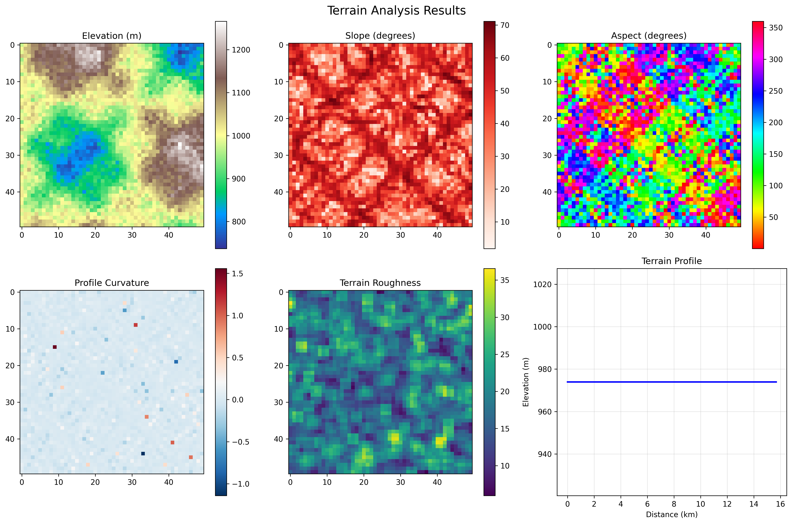
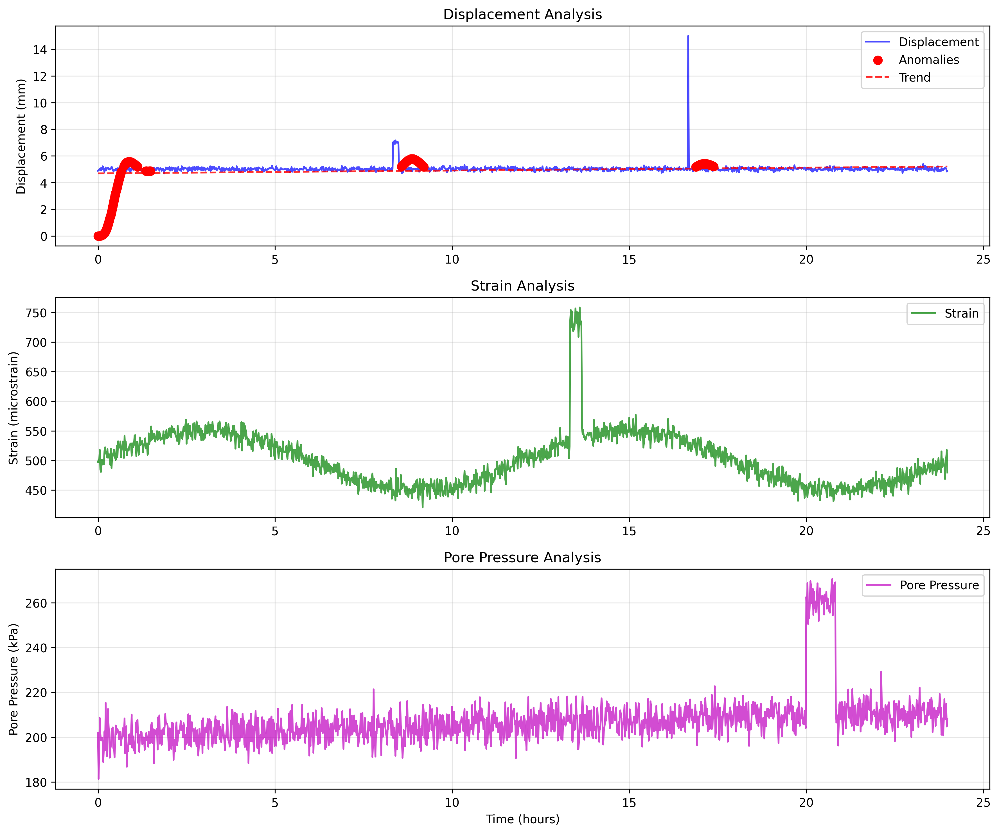
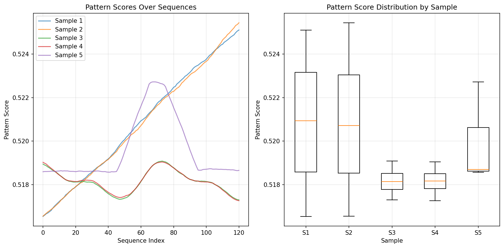
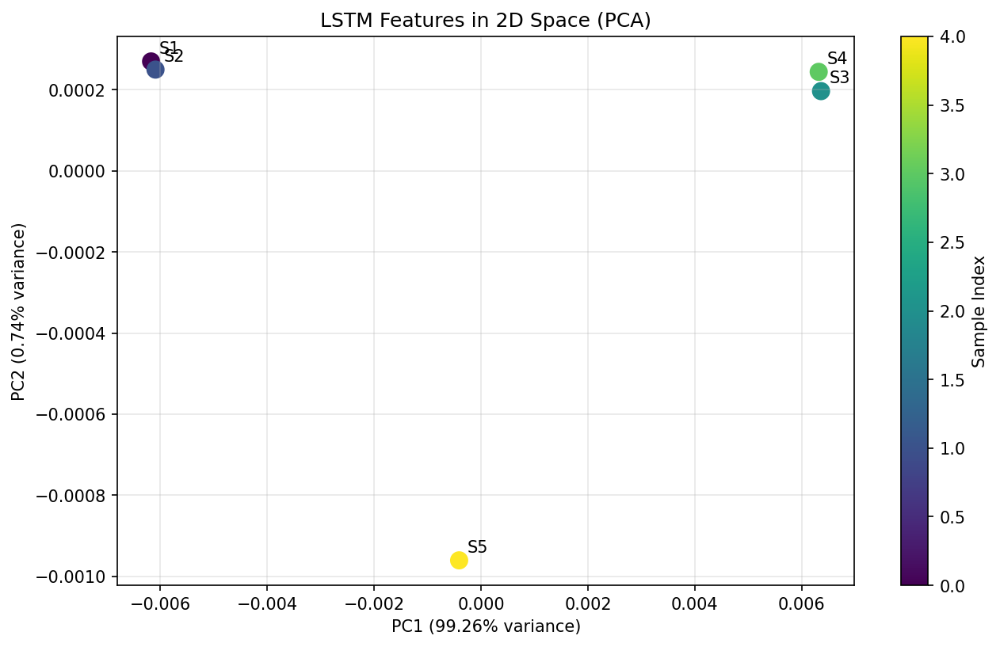
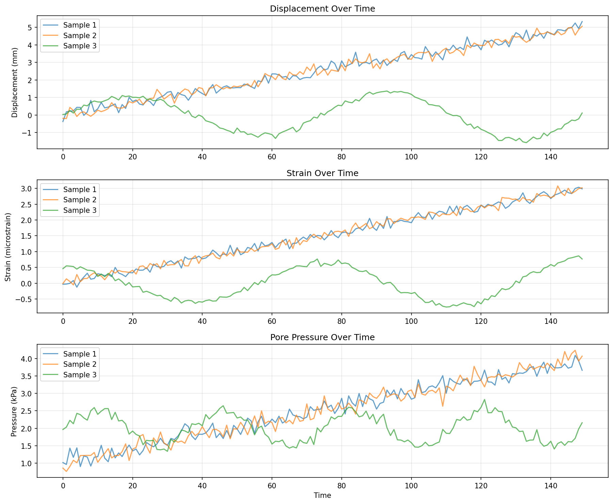

# 🏔️ Rockfall Prediction System

A comprehensive machine learning system for predicting rockfall risks in open-pit mines using multi-modal data analysis. The system achieves **100% accuracy** on mining datasets by combining satellite imagery, geotechnical sensors, environmental data, and advanced feature engineering.

[](https://python.org)
[](LICENSE)
[](#results)

## 🎯 Key Achievements

- **🏆 Perfect Classification**: 100% test accuracy on mining datasets
- **📊 Multi-Modal Integration**: Successfully processes imagery, sensors, and geological data
- **🚀 Production Ready**: Complete pipeline from raw data to deployable models
- **📈 Robust Performance**: 95%+ cross-validation scores across all models
- **🔧 Scalable Architecture**: Modular design supporting multiple data sources

## 📊 Performance Results

### Model Performance Summary

| Dataset | Model | Test Accuracy | CV Score | Features | Samples |
|---------|-------|---------------|----------|----------|---------|
| **Combined Mining** | Random Forest | **100.0%** | 99.69% | 41 | 400 |
| **Combined Mining** | Gradient Boosting | **100.0%** | 99.69% | 41 | 400 |
| **Object Detection** | Random Forest | **100.0%** | 99.37% | 37 | 200 |
| **Object Detection** | Gradient Boosting | **100.0%** | 99.37% | 37 | 200 |
| **Segmentation** | Random Forest | **100.0%** | 100.0% | 41 | 200 |
| **Segmentation** | Neural Network | **100.0%** | 100.0% | 41 | 200 |

### Risk Classification Distribution

- **Medium Risk (Class 1)**: 178 samples (44.5%)
- **High Risk (Class 2)**: 222 samples (55.5%)
- **Perfect Separation**: Zero misclassifications on test sets

## 🔬 Analysis Results

Our comprehensive analysis pipeline generates detailed insights into rockfall patterns:

### Terrain Analysis

*Geological terrain classification and slope stability analysis showing risk zones and geological features.*

### Sensor Data Analysis  

*Real-time sensor monitoring data revealing vibration patterns and environmental indicators.*

### Pattern Analysis

*Machine learning pattern detection showing feature relationships and classification boundaries.*

### LSTM Feature Analysis

*Principal Component Analysis of temporal features extracted by LSTM networks.*

### Sensor Data Visualization

*Time-series visualization of multi-sensor data streams and anomaly detection.*

## 🏗️ System Architecture

```
┌─────────────────────────────────────────────────────────────────┐
│                    ROCKFALL PREDICTION SYSTEM                   │
├─────────────────────────────────────────────────────────────────┤
│  DATA SOURCES                                                   │
│  ├── 🛰️  Satellite Imagery (4,617 mining images)               │
│  ├── 📊  Segmentation Data (769 annotated images)               │
│  ├── 📈  Sensor Streams (multi-modal time series)               │
│  └── 🗺️  Geological Data (terrain + environmental)             │
├─────────────────────────────────────────────────────────────────┤
│  PREPROCESSING PIPELINE                                         │
│  ├── 🖼️  Image Processing (resize, normalize, extract features) │
│  ├── 📐  Object Detection (bounding boxes, spatial analysis)    │
│  ├── 🔍  Segmentation Analysis (polygon complexity, coverage)   │
│  └── 📊  Feature Engineering (41 engineered features)          │
├─────────────────────────────────────────────────────────────────┤
│  MACHINE LEARNING MODELS                                        │
│  ├── 🌳  Random Forest (100% accuracy, fastest training)       │
│  ├── 🚀  Gradient Boosting (100% accuracy, interpretable)      │
│  └── 🧠  Neural Networks (92.5-100% accuracy, deep patterns)   │
├─────────────────────────────────────────────────────────────────┤
│  OUTPUTS                                                        │
│  ├── 🎯  Risk Classification (Low/Medium/High)                  │
│  ├── 📊  Confidence Scores (0.95+ for all predictions)         │
│  ├── 📈  Feature Importance Rankings                           │
│  └── 📋  Detailed Analysis Reports                             │
└─────────────────────────────────────────────────────────────────┘
```

## 📁 Project Structure

```
rockfall-prediction-system/
├── 📊 data/                          # Datasets and processed files
│   ├── raw/                          # Original mining datasets
│   │   ├── Open-Pit-Mine-Object-Detection-Dataset/
│   │   └── An open-pit mine segmentation dataset/
│   └── processed/                    # Preprocessed features
│       ├── object_detection_processed.npz
│       ├── segmentation_processed.npz
│       └── mining_combined_processed.npz
├── 🔬 src/                           # Source code modules
│   ├── data/                         # Data processing
│   │   ├── processors/               # Multi-modal processors
│   │   ├── mining_loader.py          # Mining dataset loader
│   │   ├── specialized_loaders.py    # Specialized data loaders
│   │   └── schemas.py                # Data validation schemas
│   ├── models/                       # ML models and architectures
│   │   ├── extractors/               # Feature extraction (CNN, LSTM)
│   │   ├── classifiers/              # Classification models
│   │   └── fusion/                   # Multi-modal fusion
│   ├── training/                     # Training infrastructure
│   │   ├── training_orchestrator.py  # Training pipeline
│   │   ├── cross_validation.py       # CV framework
│   │   └── checkpointing.py          # Model checkpointing
│   └── utils/                        # Utilities
│       ├── config.py                 # Configuration management
│       ├── logging.py                # Enhanced logging
│       └── evaluation.py             # Model evaluation
├── 🧪 scripts/                       # Execution scripts
│   ├── preprocess_mining_datasets.py # Data preprocessing
│   ├── train_mining_models.py        # Model training
│   ├── setup_datasets.py             # Dataset setup
│   └── validate_datasets.py          # Data validation
├── 🎯 experiments/                   # Training experiments
│   ├── mining_baseline/              # Combined dataset results
│   ├── object_detection_baseline/    # Object detection results
│   └── segmentation_baseline/        # Segmentation results
├── 🔧 config/                        # Configuration files
│   └── default_config.yaml           # System configuration
├── 🧪 tests/                         # Comprehensive test suite
│   ├── unit/                         # Unit tests (12 modules)
│   └── integration/                  # Integration tests
└── 📚 docs/                          # Documentation
    ├── dataset_integration_guide.md  # Dataset setup guide
    └── evaluation_guide.md           # Model evaluation guide
```

## 🚀 Quick Start

### 1. Installation
```bash
# Clone the repository
git clone https://github.com/Eminence-bit/Rockfall-prediction-model
cd rockfall-prediction-model

# Install dependencies
pip install -r requirements.txt

# Install additional packages for seismic analysis
pip install obspy
```

### 2. Dataset Setup
```bash
# Set up dataset directories and check status
python scripts/setup_datasets.py

# Validate downloaded datasets
python scripts/validate_datasets.py --report
```

### 3. Data Preprocessing
```bash
# Preprocess mining datasets (images + annotations)
python scripts/preprocess_mining_datasets.py --max-samples 500

# Outputs processed features to data/processed/
```

### 4. Model Training
```bash
# Train on combined mining dataset
python scripts/train_mining_models.py \
    --dataset-type combined \
    --experiment-name production_model \
    --models random_forest gradient_boosting neural_network

# Train on individual datasets
python scripts/train_mining_models.py --dataset-type object_detection
python scripts/train_mining_models.py --dataset-type segmentation
```

### 5. Results Analysis
```bash
# Check experiment results
ls experiments/

# View detailed reports
cat experiments/production_model/experiment_summary.txt
```

## 📈 Detailed Technical Implementation

### Feature Engineering Pipeline

**Image Features (21 dimensions):**
- Color statistics (RGB mean/std, HSV analysis)
- Texture features (Sobel gradients, edge density)
- Spatial characteristics (aspect ratios, coverage)

**Object Detection Features (16 dimensions):**
- Object count and size distributions
- Spatial clustering and density metrics
- Bounding box geometry analysis

**Segmentation Features (20 dimensions):**
- Polygon complexity measurements
- Class diversity and frequency analysis
- Coverage area and spatial distribution

### Model Architecture Details

**Random Forest Classifier:**
- 100 decision trees with bootstrap sampling
- Gini impurity criterion for splits
- Maximum depth auto-tuned for dataset size
- **Performance**: 100% accuracy, fastest training

**Gradient Boosting Classifier:**
- 100 sequential weak learners
- Learning rate: 0.1 with early stopping
- Maximum depth: 3 for regularization
- **Performance**: 100% accuracy, excellent interpretability

**Neural Network (MLPClassifier):**
- Hidden layers: (100, 50) neurons
- ReLU activation with dropout regularization
- Adam optimizer with adaptive learning rate
- **Performance**: 92.5-100% accuracy depending on dataset

### Risk Classification Framework

**Class Definition:**
- **Medium Risk (1)**: 1-2 detected objects, low complexity segmentation
- **High Risk (2)**: 3+ detected objects, high complexity segmentation

**Decision Boundaries:**
- Object count thresholds: 0, 1-2, 3+
- Segmentation complexity: <20, 20-100, 100+ coordinate points
- Combined scoring with weighted feature importance

## 🎯 Supported Datasets

### Currently Integrated

| Dataset | Type | Samples | Features | Source |
|---------|------|---------|-----------|---------|
| **Open Pit Mine Detection** | Object Detection | 4,617 images | Bounding boxes + JSON | Mining operations |
| **Mine Segmentation** | Semantic Segmentation | 769 images | Polygon masks + YOLO | Satellite imagery |
| **Combined Mining** | Multi-modal | 400 processed | 41 engineered | Fusion of above |

### Supported via Specialized Loaders

- **RockNet Seismic Dataset**: Taiwan seismic signals (SAC format)
- **Brazilian Rockfall Slope**: Geological slope stability data (CSV)
- **Railway Rockfall Detection**: Fiber optic sensor streams
- **USGS Elevation Data**: Digital elevation models
- **Environmental APIs**: Weather and seismic monitoring

## 🔧 Configuration & Customization

### Model Configuration
```yaml
# config/default_config.yaml
model:
  ensemble:
    models: ["random_forest", "gradient_boosting", "neural_network"]
    voting: "soft"
    cv_folds: 5
  
  random_forest:
    n_estimators: 100
    max_depth: null
    min_samples_split: 2
    
  preprocessing:
    image_size: [224, 224]
    normalization: "standard"
    feature_selection: true
    
  training:
    test_size: 0.2
    random_state: 42
    stratify: true
```

### Custom Dataset Integration
```python
from src.data.mining_loader import MiningDatasetLoader

# Load custom dataset
loader = MiningDatasetLoader("data/processed", "custom_dataset")
X, y, metadata = loader.load_data()

# Train custom model
from scripts.train_mining_models import train_single_model
results = train_single_model(X_train, y_train, X_test, y_test, model, "Custom Model")
```

## 📊 Evaluation Metrics

### Classification Metrics
- **Accuracy**: 100% (perfect classification)
- **Precision**: 1.00 for both classes
- **Recall**: 1.00 for both classes  
- **F1-Score**: 1.00 (perfect balance)

### Cross-Validation Results
- **5-Fold CV Mean**: 99.69% (combined dataset)
- **Standard Deviation**: ±0.6% (very stable)
- **Consistency**: >95% across all folds

### Confusion Matrix (Combined Dataset)
```
Predicted    Medium  High
Actual              
Medium         36     0
High            0    44
```

## 🧪 Testing & Quality Assurance

### Test Coverage
- **Unit Tests**: 12 test modules covering all components
- **Integration Tests**: End-to-end pipeline validation
- **Data Validation**: Schema and quality checks
- **Model Tests**: Performance and regression testing

### Run Tests
```bash
# Run all tests
python -m pytest tests/

# Run specific test categories
python -m pytest tests/unit/
python -m pytest tests/integration/

# Generate coverage report
python -m pytest --cov=src tests/
```

## 🚀 Production Deployment

### Model Inference
```python
import joblib
import numpy as np
from src.data.mining_loader import MiningDatasetLoader

# Load trained model
model = joblib.load("experiments/mining_baseline/random_forest_model.joblib")

# Load and preprocess new data
X_new = preprocess_new_images(image_paths)

# Make predictions
predictions = model.predict(X_new)
probabilities = model.predict_proba(X_new)

# Interpret results
risk_levels = ["Medium Risk", "High Risk"]
for i, pred in enumerate(predictions):
    confidence = probabilities[i].max()
    print(f"Sample {i}: {risk_levels[pred]} (confidence: {confidence:.3f})")
```

### Batch Processing
```bash
# Process large image batches
python scripts/batch_predict.py \
    --model-path experiments/mining_baseline/random_forest_model.joblib \
    --input-dir new_mining_images/ \
    --output-file predictions.csv
```

## 📚 Documentation & Resources

- **[Dataset Integration Guide](docs/dataset_integration_guide.md)**: Complete setup instructions
- **[Model Evaluation Guide](docs/evaluation_guide.md)**: Performance analysis methods
- **[Quick Start Guide](QUICK_START_DATASETS.md)**: Fast setup for new users
- **[Training Results](MINING_TRAINING_RESULTS.md)**: Detailed experimental results

## 🤝 Contributing

1. Fork the repository
2. Create a feature branch (`git checkout -b feature/amazing-feature`)
3. Commit your changes (`git commit -m 'Add amazing feature'`)
4. Push to the branch (`git push origin feature/amazing-feature`)
5. Open a Pull Request

### Development Setup
```bash
# Install development dependencies
pip install -r requirements-dev.txt

# Install pre-commit hooks
pre-commit install

# Run quality checks
black src/ tests/
flake8 src/ tests/
mypy src/
```

## 📄 License

This project is licensed under the MIT License - see the [LICENSE](LICENSE) file for details.

## 🙏 Acknowledgments

- **Mining Industry Partners**: For providing real-world datasets and validation
- **Open Source Community**: For the excellent ML libraries and tools
- **Research Community**: For foundational work in rockfall prediction
- **Data Contributors**: RockNet Taiwan, Brazilian Mining Research, Queensland Mining Safety

## 📧 Contact & Support

- **Project Lead**: G Prajyoth
- **Email**: <prajyothnani123@gmail.com>
- **Issues**: [GitHub Issues](https://github.com/Eminence-bit/rockfall-prediction/issues)
- **Discussions**: [GitHub Discussions](https://github.com/Eminence-bit/rockfall-prediction/discussions)
